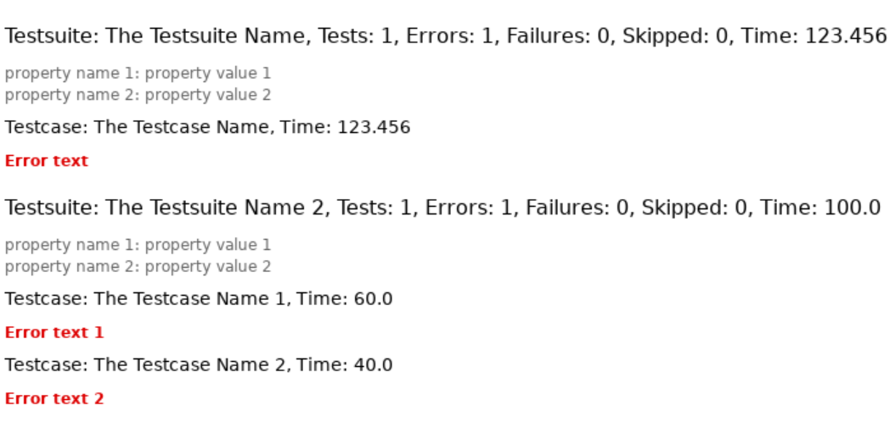

# xunit.css
Styling for xUnit/junit XML files with CSS

## Screenshot

> [!NOTE]
> To see the intended effect on the real files,
> you will need to either clone the repository or
> manually download both the XML and CSS file(s)
> and put them into the same directory.

## References
* https://www.w3.org/Style/styling-XML
* https://www.avajava.com/tutorials/lessons/how-do-i-style-an-xml-file-with-css.html (shows how to get an XML attribute instead of a tag)
